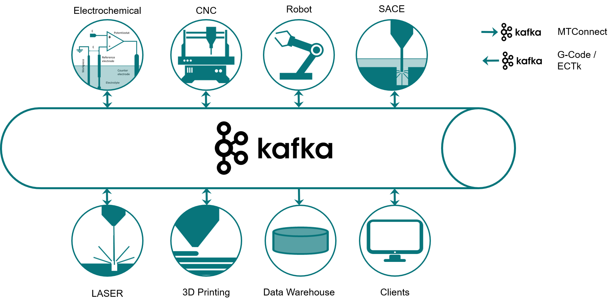
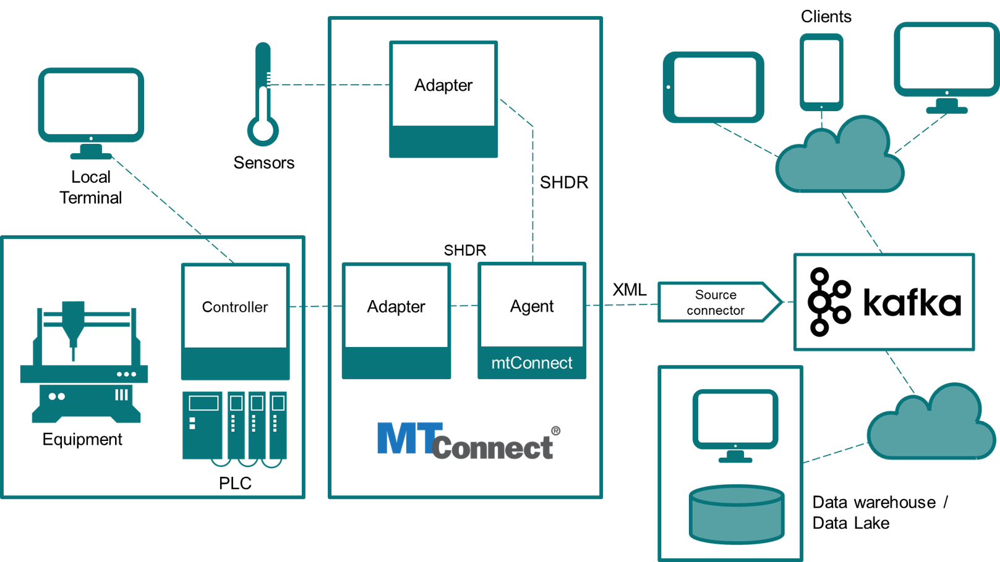

# PublicDoc
Public documentation about the Demo-Smart-Factory at Concordia University.

This demo factory is part of the Gina Cody School research center for Advanced Manufacturing and is operated by the 
[Electrochemical Green Engineering Group](http://ege.encs.concordia.ca)

## General concept

Various manufacturing technologies are assembled in this demo factory. Data exchange is taking place using a publish-subscribe paradigm and is implemented with Apache Kafka server.

Data collection uses the MTConnect standard to represent manufacturing data.

